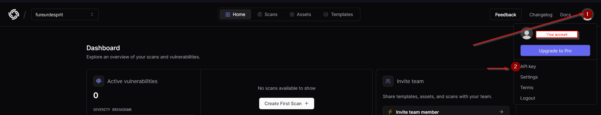
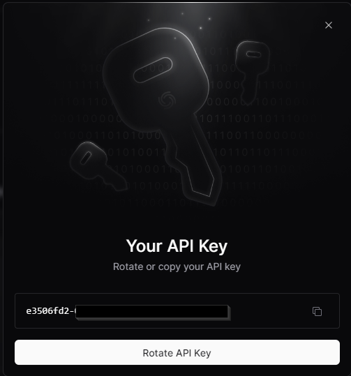

# OBJECTIVE
This script aims to help you set up a newsletter to keep track of CVE updates that may target your infrastructure, by providing a JSON file containing the necessary information to query your CMDB.

## FLOWCHART
        +---------------------+
        | Start of Program    |
        +---------------------+
                  |
                  v
        +---------------------+
        |   Define Functions  |
        +---------------------+
                  |
                  v
        +---------------------+
        |   Define Vendors    |
        +---------------------+
                  |
                  v
        +---------------------+
        |   Loop over each    |
        |   vendor            |
        +---------------------+
                  |
                  v
        +---------------------+
        |   Convert vendor    |
        |   to lowercase      |
        +---------------------+
                  |
                  v
        +---------------------+
        |   Get current date  |
        |   in YYYYMMDD format|
        +---------------------+
                  |
                  v
        +---------------------+
        |   Create directory  |
        |   for current date  |
        +---------------------+
                  |
                  v
        +---------------------+
        |   Check directory   |
        |   existence and     |
        |   create if needed  |
        +---------------------+
                  |
                  v
        +---------------------+
        |   Define JSON file  |
        |   name with full    |
        |   path              |
        +---------------------+
                  |
                  v
        +---------------------+
        |   Execute command   |
        |   to retrieve CVEs  |
        |   for the vendor    |
        +---------------------+
                  |
                  v
        +---------------------+
        |   Concatenate all   |
        |   JSON files into   |
        |   a single file     |
        +---------------------+
                  |
                  v
        +---------------------+
        |   Send email with   |
        |   JSON file as      |
        |   attachment        |
        +---------------------+
                  |
                  v
        +---------------------+
        |   Display            |
        |   confirmation       |
        |   message for email  |
        +---------------------+
                  |
                  v
        +---------------------+
        |   End of Program     |
        +---------------------+

## WHY THIS SCRIPT?
When managing an infrastructure, you have several possible sources: ANSSI (and its equivalents), CISA, CVEProject, etc. The fact is that you can quickly become overwhelmed with information, different formats, alert deadlines that may cause collisions, contradictory information, etc. This script aims to eliminate these problems and allow you to receive, at regular intervals, published vulnerabilities that may impact your infrastructure.

## PREREQUISITES
* Access to a bash shell (native Linux, or using WSL under Windows),
* [CVEMAP](https://github.com/projectdiscovery/cvemap),
* Go version 1.21 minimum,
* [A projectdiscovery.io account](https://cloud.projectdiscovery.io),
* Internet access,
* mailutils (for automated email sending).

# ADDITIONAL SCRIPTS
* newsletter_cve.sh: Bash script listing CVEs.
* check_thursday.sh: Bash script to control the execution day of the scheduled task.

# CVEMAP
## OVERVIEW
CVEMAP is a project written in Go, under the MIT license, with the objective, I quote: "to easily navigate through the jungle of CVEs". In the context of the project, this tool allows easy listing of targeted CVEs within JSON files by technology.

## INSTALLATION
On the Linux server that will execute the script, open a terminal and enter the following command:

```go install github.com/projectdiscovery/cvemap/cmd/cvemap@latest```

## API KEY RETRIEVAL
* Visit the [project discovery](https://cloud.projectdiscovery.io/sign-up) website.
* Create an account.
* In the top right corner, select "API Key".



* Copy the displayed API key.


 
## PROVIDE THE API KEY
Still on the Linux server that will execute the script, open a terminal:
* Navigate to the cvemap directory.
* Enter the following command:

```cvemap -auth```

* Provide the previously copied API key.

# SCRIPT EXECUTION
## INTEGRATE YOUR PRODUCTS INTO THE SCRIPT
The script comes with a pre-integrated list of vendors based on what is most commonly encountered, allowing you to test and understand its operation.

```
# Liste des vendors en minuscules
# Au besoin, chercher votre vendeur depuis : https://www.cvedetails.com/vendor-search.php
vendors=(
    fortinet
    checkpoint
    paloaltonetworks
    cisco
    stormshield
    f5
    php
    apache
    microsoft
)
```

## SEARCH VIA CVSS SCORE / DATE
For this part, I recommend following the CVEMAP documentation and adapting the command from line 61 to your needs.

## SCRIPT COPYING
Place the script in the CVEMAP directory.

## MAKE THE SCRIPT EXECUTABLE
* On the server, enter the following command:

```chmod +x newsletter_cve.sh```

## EXECUTE THE SCRIPT (MANUAL)
* Navigate to the CVEMAP directory.
* Enter the following command:

```./newsletter_cve.sh```

# EXECUTE THE SCRIPT (MONTHLY CRONTAB)
On the server running CVEMAP:
* Enter the following command:

```crontab -e```

* Add the following line:

```0 0 * * 4 /path/to/check_thursday.sh```

## DISCLAIMER
The check_thursday.sh script aims to allow execution of the script once a month following the Patch Tuesday principle. I have not found an elegant solution to easily identify this type of redundancy, so I opted for a script that checks the date and calculates if it is appropriate to trigger the execution.

If you want another frequency, feel free to adjust the crontab. ([help](https://crontab.guru))