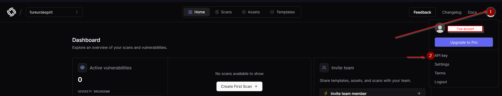
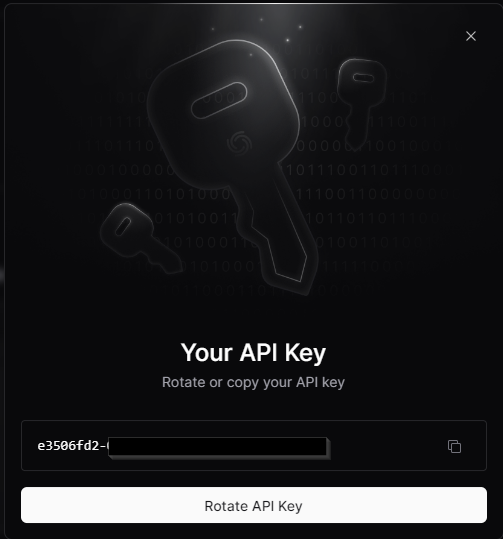

# OBJET
Ce script a pour objectif de vous permettre de mettre en place une newsletter permettant de suivre l'actualité des CVE susceptibles de cibler votre parc, en fournissant un JSON comportant les informations nécessaires pour interroger votre CMDB.

## LOGIGRAMME
        +---------------------+
        | Début du programme  |
        +---------------------+
                  |
                  v
        +---------------------+
        |   Définition des    |
        |   fonctions         |
        +---------------------+
                  |
                  v
        +---------------------+
        |   Définition des    |
        |   vendors           |
        +---------------------+
                  |
                  v
        +---------------------+
        |   Boucle sur chaque |
        |   vendor            |
        +---------------------+
                  |
                  v
        +---------------------+
        |   Convertir le      |
        |   vendor en         |
        |   minuscules        |
        +---------------------+
                  |
                  v
        +---------------------+
        |   Récupérer la date |
        |   actuelle au       |
        |   format YYYYMMDD   |
        +---------------------+
                  |
                  v
        +---------------------+
        |   Créer un          |
        |   répertoire pour   |
        |   la date actuelle  |
        +---------------------+
                  |
                  v
        +---------------------+
        |   Vérifier          |
        |   l'existence du    |
        |   répertoire et     |
        |   le créer si       |
        |   nécessaire        |
        +---------------------+
                  |
                  v
        +---------------------+
        |   Définir le nom du |
        |   fichier JSON      |
        |   avec le chemin    |
        |   complet           |
        +---------------------+
                  |
                  v
        +---------------------+
        |   Exécuter la       |
        |   commande pour     |
        |   récupérer les CVE |
        |   pour le vendor    |
        +---------------------+
                  |
                  v
        +---------------------+
        |   Concaténer tous   |
        |   les fichiers JSON |
        |   dans un seul      |
        |   fichier           |
        +---------------------+
                  |
                  v
        +---------------------+
        |   Envoyer un email  |
        |   avec le fichier   |
        |   JSON en pièce     |
        |   jointe            |
        +---------------------+
                  |
                  v
        +---------------------+
        |   Afficher un       |
        |   message de        |
        |   confirmation de   |
        |   l'envoi de        |
        |   l'email           |
        +---------------------+
                  |
                  v
        +---------------------+
        |   Fin du programme  |
        +---------------------+


## POURQUOI CE SCRIPT ?
Lorsque vous gérez un parc, vous avez plusieurs sources possibles : l'ANSSI (et ses équivalents), le CISA, CVEProject, etc. Le fait est que vous pouvez vite être noyé sous la masse d'informations, les formats différents, les délais d'alerte pouvant occasionner des collisions, les informations contradictoires, etc. Ce script a pour ambition de faire disparaître ces problèmes et de vous permettre de recevoir, à intervalles réguliers, les vulnérabilités publiées pouvant impacter votre infrastructure.

## PREREQUIS
* Accès à un bash (native linux, sous Windows utilisé WSL),
* [CVEMAP](https://github.com/projectdiscovery/cvemap),
* Go version 1.21 minimum,
* [Un compte projectdiscovery.io](https://cloud.projectdiscovery.io),
* Accès internet,
* mailutils (pour l'envoi de mails automatiquement)

# SCRIPTS ANNEXES
* newsletter_cve.sh : script bash listant les CVE.
* check_thursday.sh : script bash permettant de contrôler le jour d’éxécution de la tâche planifiée.

# CVEMAP
## PRESENTATION
CVEMAP est un projet écrit en Go, sous licence MIT, dont l'objectif est, je cite : "naviguer facilement à travers la jungle des CVE". Dans le cadre du projet, cet outil permet de lister facilement les CVE ciblées au sein de fichiers JSON par technologie.

## INSTALLATION
Sur le serveur Linux qui éxécutera le script, exécuter un terminal puis saisir la commande suivante : 

```go install github.com/projectdiscovery/cvemap/cmd/cvemap@latest```

##	RECUPERATION DE LA CLEF API
* Se rendre sur le site [project discovery](https://cloud.projectdiscovery.io/sign-up)
* Créer un compte
* En haut à droite,sélectionner "API Key"



* Copier la clef API qui s'affiche


 
##	FOURNIR LA CLEF API
Toujours sur le serveur Linux qui éxécutera le script, exécuter un terminal :
* Se rendre dans le dossier cvemap
* Saisir la commande suivante : 

```cvemap -auth```

* Fournir la clef API précédemment copiée.

# EXECUTION DU SCRIPT
## INTEGRER VOS PRODUITS AU SCRIPT
Le script est fourni avec une liste de vendeur préintégré basé sur ce qu'on rencontre le plus souvent et vous permettant de tester et comprendre le fonctionnement.

```
# Liste des vendors en minuscules
# Au besoin, chercher votre vendeur depuis : https://www.cvedetails.com/vendor-search.php
vendors=(
    fortinet
    checkpoint
    paloaltonetworks
    cisco
    stormshield
    f5
    php
    apache
    microsoft
)
```

## RECHERCHER VIA SCORE CVSS / DATE
Pour cette partie, je vous recommande de suivre la documentation de CVEMAP et d'adapter la commande de la ligne 61 à vos besoins.

## COPIE DU SCRIPT
Mettre le script dans le dossier de CVEMAP.

## RENDRE LE SCRIPT EXECUTABLE
* Sur le serveur, saisir la commande suivante :

```chmod +x newsletter_cve.sh```

##	EXECUTER LE SCRIPT (MANUEL)
* Se rendre dans le dossier CVEMAP
* Saisir la commande suivante : 

```./newsletter_cve.sh```

# EXECUTER LE SCRIPT (CRONTAB MENSUEL)
Sur le serveur exécutant CVEMAP : 
* Saisir la commande suivante : 

```Crontab -e```

* Ajouter la ligne suivante : 

```0 0 * * 4 /chemin/vers/check_thursday.sh```

## DISCLAIRMER
Le script check_thursday.sh a pour but de permettre d'exécuter le script une fois par mois suivant le principe du Patch Tuesday. Je n'ai pas trouvé de solution élégante pour identifier facilement ce type de redondance, je suis donc parti sur l'idée d'un script qui vérifie la date et calcule s'il est opportun de lancer l'exécution.

Si vous souhaitez une autre périodicité, libre à vous d'adapter le crontab. ([aide](https://crontab.guru))